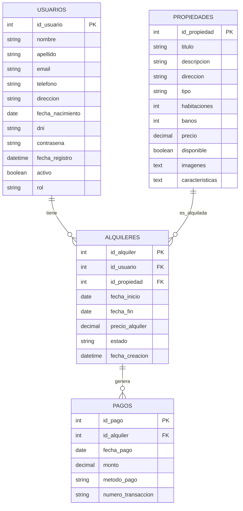

---
# 
# Sistema de Alquileres

**Autor:** Federico Rios (emprendedor)  
**Fecha:** 2024-06-09  
**Institución:** Autónomo

---

## Índice

1. [Misión, Visión y Objetivos](#misión-visión-y-objetivos)
2. [Resumen del Proyecto](#resumen-del-proyecto)
3. [Arquitectura General](#arquitectura-general)
4. [Base de Datos](#base-de-datos)
5. [Backend (Flask)](#backend-flask)
6. [Frontend (React)](#frontend-react)
7. [Tecnologías Utilizadas](#tecnologías-utilizadas)
8. [Roadmap](#roadmap)
9. [Anexos](#anexos)

---

## Misión, Visión y Objetivos

### **Misión**
Brindar una plataforma digital eficiente y segura para conectar personas que buscan alquilar propiedades con dueños que desean gestionar y ofrecer sus inmuebles.

### **Visión**
Convertirse en una solución de referencia para alquileres, facilitando la experiencia tanto para inquilinos como para propietarios, con tecnología moderna y procesos transparentes.

### **Objetivos**
- Permitir a los usuarios buscar, reservar y gestionar alquileres de manera sencilla.
- Ofrecer a los dueños herramientas para administrar sus propiedades y alquileres.
- Garantizar la seguridad de los datos y la facilidad de uso.
- Escalar la plataforma para soportar nuevas funcionalidades y usuarios.

---

## Resumen del Proyecto

El sistema de alquileres es una aplicación web full-stack que permite a usuarios registrarse como inquilinos o propietarios, gestionar propiedades, realizar reservas y pagos, y administrar el ciclo completo de un alquiler.  
El backend está desarrollado en **Python (Flask)** y el frontend en **React**.

---

## Arquitectura General

```mermaid
flowchart TD
    subgraph Frontend [Frontend (React)]
        A1[Welcome.js]
        A2[Auth.js]
        A3[Dashboard.js]
        A4[Map.js]
        A5[Navbar.js]
    end
    subgraph Backend [Backend (Flask)]
        B1[app.py]
        B2[modelos.py]
        B3[servicio_usuario.py]
        B4[extensiones.py]
        B5[API REST]
    end
    subgraph DB [Base de Datos MySQL]
        C1[(usuarios)]
        C2[(propiedades)]
        C3[(alquileres)]
        C4[(pagos)]
    end
    A1-->|HTTP/JSON|B5
    A2-->|HTTP/JSON|B5
    A3-->|HTTP/JSON|B5
    A4-->|HTTP/JSON|B5
    A5-->|HTTP/JSON|B5
    B5-->|ORM|C1
    B5-->|ORM|C2
    B5-->|ORM|C3
    B5-->|ORM|C4
```

---

## Base de Datos

**Modelo entidad-relación simplificado:**



---

## Backend (Flask)

- **Estructura modular:**  
  - `app.py`: Configuración principal y rutas.
  - `modelos.py`: Modelos SQLAlchemy.
  - `servicio_usuario.py`: Lógica de negocio para usuarios.
  - `extensiones.py`: Instancia de SQLAlchemy y otras extensiones.
- **Migraciones:**  
  - Uso de Flask-Migrate/Alembic para versionar la base de datos.
- **Endpoints REST:**  
  - CRUD para usuarios, propiedades, alquileres y pagos.
- **Autenticación:**  
  - Manejo de contraseñas seguras y sesiones con Flask-Login.

---

## Frontend (React)

- **Componentes principales:**
  - `Welcome.js`: Landing page con botones dinámicos para inquilinos y dueños.
  - `Auth.js`: Login y registro con diseño personalizado.
  - `Dashboard.js`, `Map.js`, `Navbar.js`, etc.: Funcionalidades específicas.
- **Estilos:**  
  - Uso de CSS moderno (glassmorphism, animaciones).
- **Comunicación con backend:**  
  - Consumo de la API REST vía fetch/axios.

---

## Tecnologías Utilizadas

- **Lenguajes:**  
  - Python (Flask, SQLAlchemy)
  - JavaScript (React)
  - SQL (MySQL)
- **Frameworks y librerías:**  
  - Flask, Flask-Migrate, Flask-Login
  - React, React Router, React Bootstrap, React Leaflet
- **Herramientas de edición:**  
  - VSCode, PyCharm, MySQL Workbench, Postman, Insomnia
- **Control de versiones:**  
  - Git
- **Diagramas:**  
  - Mermaid.js (para documentación)

---

## Roadmap

> **Roadmap:** Es una hoja de ruta o plan de desarrollo futuro del proyecto.

- [x] Definir y crear la base de datos inicial
- [x] Modelar entidades en SQLAlchemy
- [x] Configurar migraciones con Flask-Migrate
- [x] Crear endpoints REST para usuarios
- [x] Estructurar frontend en React
- [ ] Completar endpoints para propiedades, alquileres y pagos
- [ ] Integrar autenticación completa (JWT o sesiones)
- [ ] Mejorar la UI/UX del frontend
- [ ] Implementar tests automáticos
- [ ] Desplegar en producción

---

## Anexos

- **Scripts de prueba:**  
  Ejemplo de creación de usuario en `acciones_demo1.py`:
  ```python
  from app import app
  from modelos import db, Usuario

  with app.app_context():
      nuevo_usuario = Usuario(
          nombre="Test",
          apellido="User",
          email="test@example.com",
          contrasena="hashed_password"
      )
      db.session.add(nuevo_usuario)
      db.session.commit()
      print("Usuario creado:", nuevo_usuario)
  ```

- **Logo generado:**  
  

---